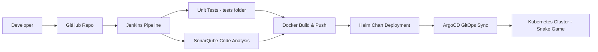
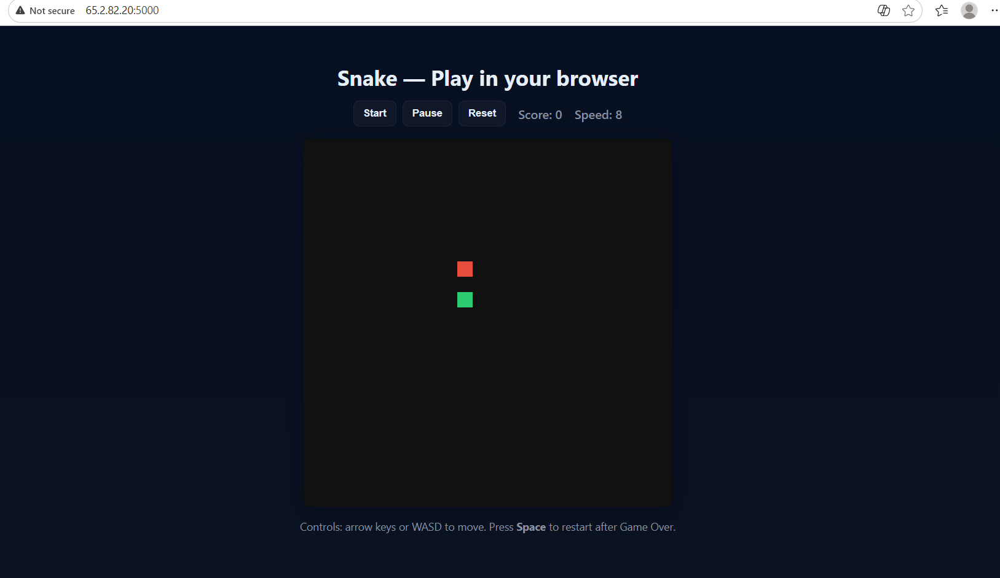
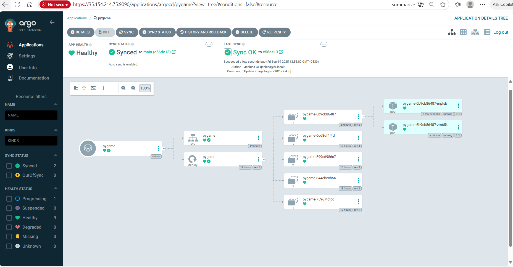

## Snake Game - Flask + Kubernetes + ArgoCD

A simple **Snake Game** built with **Flask**, Dockerized, deployed with **Helm**, and managed with **ArgoCD**.

## 📂 Project Structure

```

├── argocd/
│   └── application.yaml
├── helm-chart/
│   ├── Chart.yaml
│   ├── values.yaml
│   └── templates/
│       ├── deployment.yaml
│       ├── service.yaml
│       └── _helpers.tpl
├── snake-flask/
│   ├── app.py
│   ├── templates/
│   │   └── index.html
│   └── static/css/
│       └── style.css
├── tests/
├── Dockerfile
├── requirements.txt
└── sonar-project.properties
```

## ✨ Features

* Snake Game UI – Classic snake game built with Flask + HTML/CSS.

* Dockerized – Portable container image built from Dockerfile.

* Kubernetes Ready – Deployment & Service defined with Helm charts (deployment.yaml, service.yaml).

* GitOps with ArgoCD – Continuous Delivery managed through ArgoCD (application.yaml).

* CI/CD Pipeline – Jenkins pipeline automates build, test, and deployment.

* Helm Packaging – Configurable deployments via values.yaml.

* Testing Ready – Unit tests inside /tests folder.

* SonarQube Integration – Code quality & static analysis using sonar-project.properties.

* Configurable Secrets – Secure handling of credentials for Kubernetes.

* Scalable & Cloud-Native – Can run on any Kubernetes cluster (Kind, Minikube, EKS, GKE, AKS)

## 📊 CI/CD Pipeline



## 🎮 Demo - Snake Game



## 🚀 Argocd Deployment View




