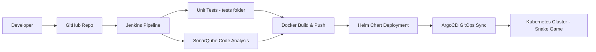

## Snake Game - Flask + Kubernetes + ArgoCD

A simple **Snake Game** built with **Flask**, Dockerized, deployed with **Helm**, and managed with **ArgoCD**.

## 📂 Project Structure

```

├── argocd/
│   └── application.yaml
├── helm-chart/
│   ├── Chart.yaml
│   ├── values.yaml
│   └── templates/
│       ├── deployment.yaml
│       ├── service.yaml
│       └── _helpers.tpl
├── snake-flask/
│   ├── app.py
│   ├── templates/
│   │   └── index.html
│   └── static/css/
│       └── style.css
├── tests/
├── Dockerfile
├── requirements.txt
└── sonar-project.properties
```

## ✨ Features

* Snake Game UI – Classic snake game built with Flask + HTML/CSS.

* Dockerized – Portable container image built from Dockerfile.

* Kubernetes Ready – Deployment & Service defined with Helm charts (deployment.yaml, service.yaml).

* GitOps with ArgoCD – Continuous Delivery managed through ArgoCD (application.yaml).

* CI/CD Pipeline – Jenkins pipeline automates build, test, and deployment.

* Helm Packaging – Configurable deployments via values.yaml.

* Testing Ready – Unit tests inside /tests folder.

* SonarQube Integration – Code quality & static analysis using sonar-project.properties.

* Configurable Secrets – Secure handling of credentials for Kubernetes.

* Scalable & Cloud-Native – Can run on any Kubernetes cluster (Kind, Minikube, EKS, GKE, AKS)

## 📊 CI/CD Pipeline



## 🎮 Demo - Snake Game


## 🚀 Argocd Deployment View


## 1️⃣ Install Jenkins

```
sudo apt update
sudo apt install -y openjdk-17-jdk

```

## Add Jenkins Repository & Key

```
curl -fsSL https://pkg.jenkins.io/debian-stable/jenkins.io-2023.key | sudo tee \
  /usr/share/keyrings/jenkins-keyring.asc > /dev/null

echo deb [signed-by=/usr/share/keyrings/jenkins-keyring.asc] \
  https://pkg.jenkins.io/debian-stable binary/ | \
  sudo tee /etc/apt/sources.list.d/jenkins.list > /dev/null
```
## Install Jenkins

```
sudo apt update
sudo apt install -y jenkins
```
## 2️⃣ Docker Installation

```
sudo apt update && sudo apt install -y docker.io
sudo usermod -aG docker $USER
newgrp docker
```
### 3️⃣ SonarQube Installation

```
sudo apt update && sudo apt upgrade -y
sudo apt install -y openjdk-17-jdk
java -version
cd /opt
sudo wget https://binaries.sonarsource.com/Distribution/sonarqube/sonarqube-10.5.1.90531.zip
sudo apt install -y unzip
sudo unzip sonarqube-10.5.1.90531.zip
sudo mv sonarqube-10.5.1.90531 sonarqube
sudo chown -R ubuntu:ubuntu sonarqube
sudo useradd -d /opt/sonarqube -s /bin/bash sonar
sudo chown -R sonar:sonar /opt/sonarqube

```
### 4️⃣ Install & Configure Snyk
```
curl https://static.snyk.io/cli/latest/snyk-linux -o snyk
chmod +x snyk
sudo mv snyk /usr/local/bin/
```
### 5️⃣ Install Kind

```
curl -Lo ./kind https://kind.sigs.k8s.io/dl/v0.22.0/kind-linux-amd64
chmod +x ./kind
sudo mv ./kind /usr/local/bin/kind
```
### Cluster Config (kind-config.yaml)

```
kind: Cluster
apiVersion: kind.x-k8s.io/v1alpha4
nodes:
- role: control-plane
- role: worker
- role: worker

### Create Cluster

```
kind create cluster --config kind-config.yaml
kind get clusters
```

### 6️⃣ Install Kubectl

```
curl -LO "https://dl.k8s.io/release/$(curl -sL https://dl.k8s.io/release/stable.txt)/bin/linux/amd64/kubectl"
chmod +x kubectl
sudo mv kubectl /usr/local/bin/

```

### 7️⃣ Install ArgoCD

```
kubectl create namespace argocd
kubectl apply -n argocd -f https://raw.githubusercontent.com/argoproj/argo-cd/stable/manifests/install.yaml
kubectl get pods -n argocd

```

### 8️⃣ Install Helm

```
sudo apt-get update
sudo apt-get install -y curl apt-transport-https gnupg
curl https://baltocdn.com/helm/signing.asc | sudo apt-key add -
echo "deb https://baltocdn.com/helm/stable/debian/ all main" | sudo tee /etc/apt/sources.list.d/helm-stable-debian.list
sudo apt-get update
sudo apt-get install -y helm

```


